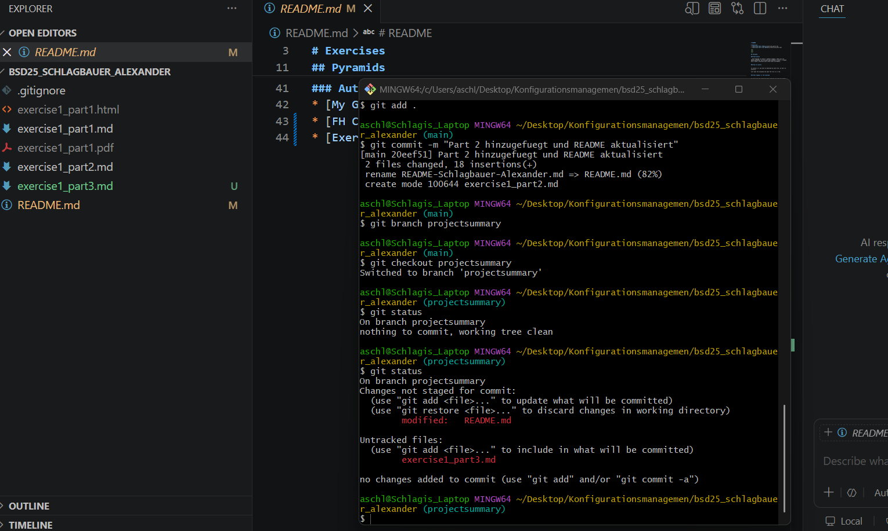

# Project Summary: Visual Studio Code

Visual Studio Code (VS Code) ist ein kostenloser, quelloffener Code-Editor, der maßgeblich von Microsoft entwickelt wird. Das Projekt liegt öffentlich auf GitHub und ist eines der beliebtesten Werkzeuge für Softwareentwickler weltweit. Es unterstützt nahezu alle Programmiersprachen durch eine riesige Auswahl an Erweiterungen.

Besonders spannend an diesem Repository ist die riesige Community: Tausende von Entwicklern aus der ganzen Welt arbeiten aktiv daran mit, melden Fehler (Issues) oder programmieren selbst neue Funktionen (Pull Requests).

